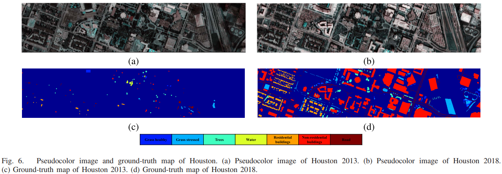
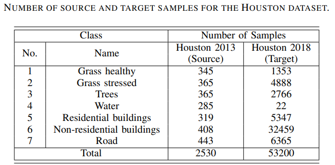
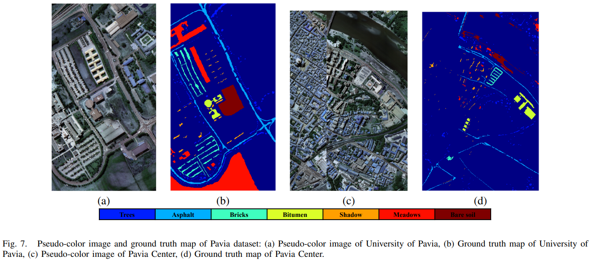
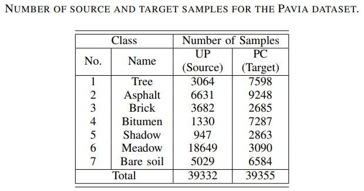
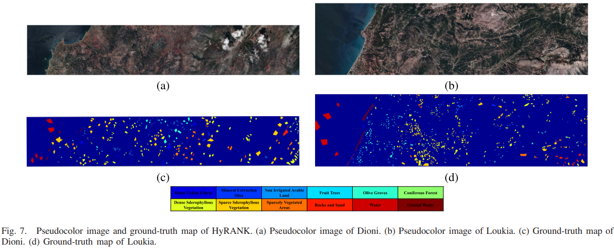
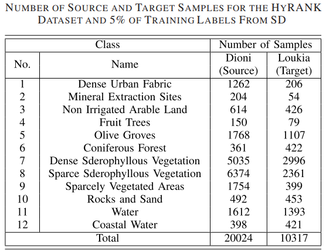

# Open source datasets for Cross-Scene Hyperspectral Image Classification

**Houston datasets:** Houston 2013 and Houston 2018.  | Thanks [Xudong Zhao](https://github.com/xudongzhao461) for his work in producing the Houston data.

download: [坚果云](https://www.jianguoyun.com/p/DSDqQfIQncXpChjy9dAEIAA) or [Google-drive](https://drive.google.com/drive/folders/1N9czbGBoJXVHycuXoTq8ba32eebydYPp?usp=sharing)

<p align='center'>
  
  
</p>


**Pavia datasets:** University of Pavia (UP) and Pavia Center (PC).

download: [坚果云](https://www.jianguoyun.com/p/Daiu5IsQncXpChj99dAEIAA) or [Google-drive](https://drive.google.com/drive/folders/1XSSZcdp9fed4bxVrKKONNXbDzbYqTsjc?usp=sharing)

<p align='center'>
  
  
</p>

**HyRank datasets:** Dioni and Loukia.

download: [坚果云](https://www.jianguoyun.com/p/DT4z7ugQncXpChj19dAEIAA) or [Google-drive](https://drive.google.com/drive/folders/13T47hw6RZnz1_CE7gG1QgYIYS2SDJ5DD?usp=sharing)

<p align='center'>
  
  
</p>

## Dataset

The dataset directory should look like this:
```bash
datasets
├── Houston
│   ├── Houston13.mat
│   ├── Houston13_7gt.mat
│   ├── Houston18.mat
│   └── Houston18_7gt.mat
├── Pavia
│   ├── paviaC.mat
│   └── paviaC_7gt.mat
│   ├── paviaU.mat
│   └── paviaU_7gt.mat
└──  HyRANK
    ├── Dioni.mat
    └── Dioni_gt_out68.mat
    ├── Loukia.mat
    └── Loukia_gt_out68.mat
```

## Note

- The variable names of data and gt in .mat file are set as `ori_data` and `map`.
- Pseudo-color image of all data are provided in `./figure` for use in writing papers.
- The HyRANK dataset is screened for classes and samples. The gt used in the experiment is `*_gt_out68.mat`.

## Paper

Please cite our paper if you find these datasets useful for your research.

```
@ARTICLE{9540028,
  author={Zhang, Yuxiang and Li, Wei and Zhang, Mengmeng and Qu, Ying and Tao, Ran and Qi, Hairong},
  journal={IEEE Transactions on Neural Networks and Learning Systems}, 
  title={Topological Structure and Semantic Information Transfer Network for Cross-Scene Hyperspectral Image Classification}, 
  year={2021},
  volume={},
  number={},
  pages={1-14},
  doi={10.1109/TNNLS.2021.3109872}}
@ARTICLE{9812472,  
  author={Zhang, Yuxiang and Li, Wei and Zhang, Mengmeng and Wang, Shuai and Tao, Ran and Du, Qian},  
  journal={IEEE Transactions on Neural Networks and Learning Systems},   
  title={Graph Information Aggregation Cross-Domain Few-Shot Learning for Hyperspectral Image Classification},  
  year={2022},  
  volume={},  
  number={},  
  pages={1-14},  
  doi={10.1109/TNNLS.2022.3185795}}
```